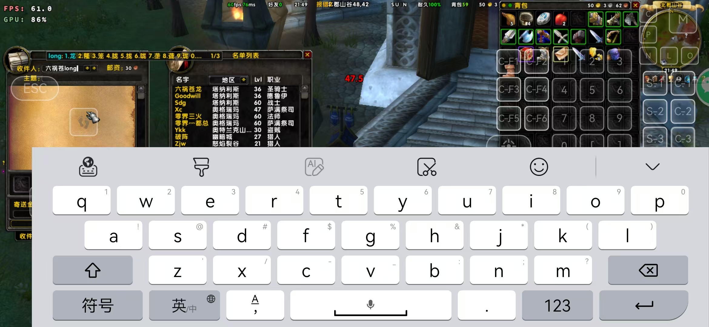

# WowCNInput - WoW 1.12 中文输入法插件

作者: Wigmox  
适配客户端: WoW 1.12 (Interface: 11200)

## 插件简介

这是一个为 World of Warcraft 1.12 版本（乌龟服） Lua 中文输入法插件。

主要用于解决在 Winlotar、盖世游戏等模拟器模式下通过 Wine/Proton 运行 WoW 时无法使用手机输入法输入中文的问题。该插件完全独立于操作系统，适配 WoW 1.12 版本。同时也适用于 Windows 用户在没有中文输入法或系统输入法导致游戏不稳定时作为替代方案。

## 使用截图

### 输入界面


### 候选词显示



## 主要特性

- 拼音输入法支持
- 候选词翻页功能

## 支持场景

插件支持以下输入场景：

- 聊天框
- 邮件收件人
- 邮件主题
- 邮件正文

## 安装方法

### 方法一：GitHub 下载

1. 访问 GitHub 仓库页面
2. 点击 "Code" 按钮，选择 "Download ZIP" 下载压缩包
3. 解压下载的 ZIP 文件
4. 将解压后的文件夹重命名为 `WowCNInput`（删除可能存在的 `-main` 后缀）
5. 将 `WowCNInput` 文件夹复制到游戏插件目录：
   ```
   游戏目录/Interface/AddOns/
   ```

### 方法二：Releases 下载

1. 访问 GitHub 仓库的 "Releases" 页面
2. 下载最新版本的发布包
3. 解压下载的压缩包
4. 将解压后的 `WowCNInput` 文件夹复制到游戏插件目录

## 使用方法
- 插件选择界面勾选插件（默认勾选）

### 命令

- `/wi` 或 `/winput` - 临时关闭/开启输入法

### 输入操作

输入方式类似智能拼音，操作简单：

1. 输入拼音后，候选框自动显示
2. 数字键 1-0 选择对应候选词
3. 空格键 选择第一个候选词
4. **翻页键（英文键盘）**：
   - `,` 或 `-` 键：向上翻页
   - `.` 或 `=` 键：向下翻页

## 常见问题

**Q: 输入法不显示候选框？**  
A: 请确认输入法已开启（输入 `/wi` 检查状态），并确保字库文件正确加载。

**Q: 候选词太多，如何翻页？**  
A: 使用 `,` 或 `-` 键翻到上一页，`.` 或 `=` 键翻到下一页。

## 致谢

- 感谢 [rime-ice](https://github.com/iDvel/rime-ice) 提供的字库支持

## 请我喝奶茶

如果这个插件对你有帮助，可以请我喝奶茶哦 😊


