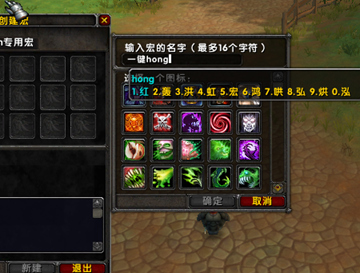
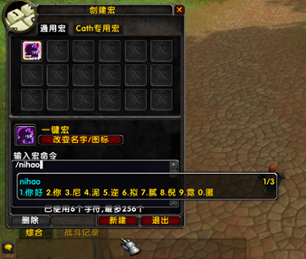
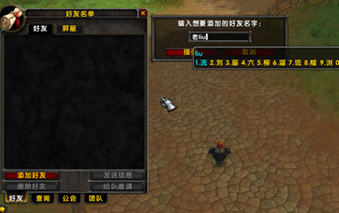

# WowCNInput - WoW 1.12 中文输入法插件

作者: Wigmox  
适配客户端: WoW 1.12 (Interface: 11200)  

## 插件简介

这是一个为 World of Warcraft 1.12 版本（乌龟服）的 Lua 中文输入法插件。

主要用于解决在 Winlator、盖世游戏等模拟器模式下通过 Wine/Proton 运行 WoW 时无法使用手机输入法输入中文的问题。该插件完全独立于操作系统，适配 WoW 1.12 版本。同时也适用于 Windows 用户在没有中文输入法或系统输入法导致游戏不稳定时作为替代方案。

## 使用截图

### 输入界面


### 宏界面



### 好友界面


## 主要特性

- ✅ 拼音输入法支持
- ✅ 候选词翻页功能
- ✅ 最大化分段适配候选，连续候选
- ✅ 防遮挡机制（移动端适配）
- ✅ 双行显示，拼音候选单独显示一行
- ✅ 中英文混合输入。输入字母后，如果需要输入英文，或者命令，按回车即可输入。后续还可以继续输入拼音中文。
## 支持场景

插件支持以下输入场景：

- ✅ 聊天框
- ✅ 宏命令大输入框
- ✅ 宏新建起名框
- ✅ 公会信息框（未测试）
- ✅ 公会公告框（未测试）
- ✅ 好友面板：添加好友
- ✅ 好友面板：屏蔽玩家
- ✅ 邮件：收件人
- ✅ 邮件：主题
- ✅ 邮件：正文
- ✅ 拍卖行搜索（仅系统默认模式，拍卖行插件不支持）
- ✅ 各种系统弹窗输入框（如公会邀请、改名等）（未测试）

## 安装方法

### 方法一：GitHub 下载

1. 访问 GitHub 仓库页面
2. 点击 "Code" 按钮，选择 "Download ZIP" 下载压缩包
3. 解压下载的 ZIP 文件
4. 将解压后的文件夹重命名为 `WowCNInput`（删除可能存在的 `-main` 后缀）
5. 将 `WowCNInput` 文件夹复制到游戏插件目录：
   ```
   游戏目录/Interface/AddOns/
   ```

### 方法二：Releases 下载

1. 访问 GitHub 仓库的 "Releases" 页面
2. 下载最新版本的发布包
3. 解压下载的压缩包
4. 将解压后的 `WowCNInput` 文件夹复制到游戏插件目录

## 使用方法
- 插件选择界面勾选插件（默认勾选）
- 游戏内按回车即可进入输入模式，手机端调出虚拟键盘切换到英文模式，“关闭英文联想功能”

### 命令

- `/wi` 或 `/winput` - 临时关闭/开启中文输入
- 按键绑定界面可以绑定自定义按键开关切换中文输入
### 输入操作

输入方式类似智能拼音，操作简单：

1. 输入字母后，候选框自动显示
2. 数字键 1-0 选择对应候选词
3. 空格键 选择第一个候选词
4. **翻页键（英文键盘）**：
   - `,` 或 `-` 键：向上翻页
   - `.` 或 `=` 键：向下翻页

## 常见问题

**Q: 输入法不显示候选框？**  
A: 请确认输入法已开启（输入 `/wi` 检查状态），并确保字库文件正确加载。

**Q: 候选词太多，如何翻页？**  
A: 使用 `,` 或 `-` 键翻到上一页，`.` 或 `=` 键翻到下一页。

**Q: 输入时卡顿怎么办？**  
A: 0.0.2 版本已进行性能优化，大幅提升了候选词匹配速度。如果仍然卡顿，请检查：
1. 字库文件是否过大
2. 游戏客户端性能设置
3. 系统资源占用情况

## 更新日志

详细更新内容请查看 [CHANGELOG.md](CHANGELOG.md)

## 致谢

- 感谢 [rime-ice](https://github.com/iDvel/rime-ice) 提供的字库支持

## 请我喝奶茶

如果这个插件对你有帮助，可以请我喝奶茶哦 😊


